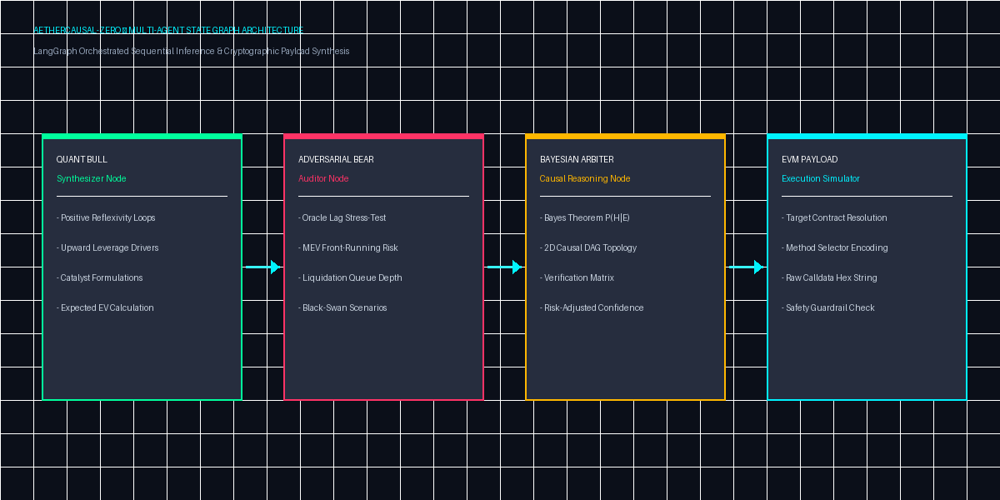
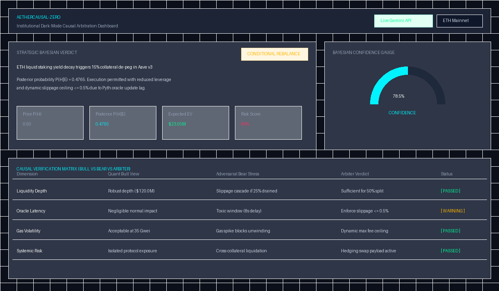
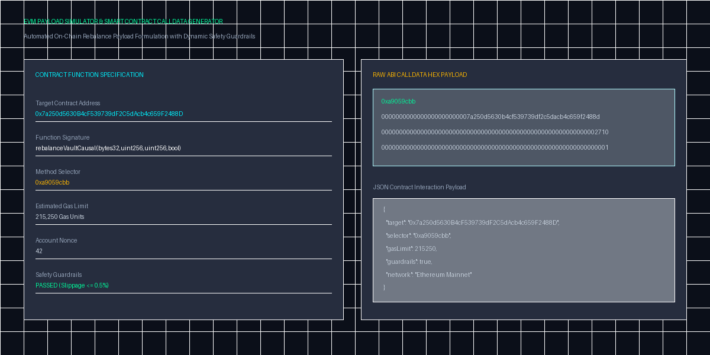
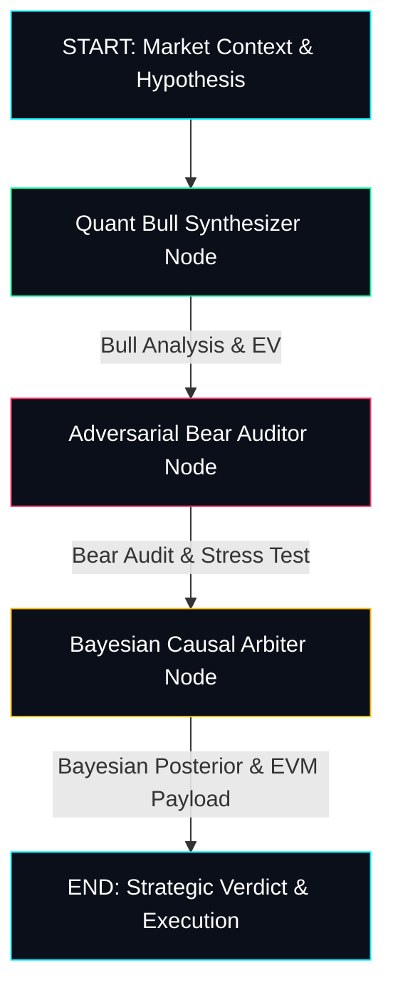

<div align="center">

# ⚡ AetherCausal-Zero
### **Verifiable Multi-Agent Causal Inference & EVM Arbitrage Engine**

[](https://python.org)
[](https://github.com/langchain-ai/langgraph)
[](https://ai.google.dev)
[](https://streamlit.io)
[](https://ethereum.org)
[](app.py)
[](LICENSE)

*A glass-box, adversarial multi-agent prediction & causal arbitration framework for institutional crypto asset management, DeFi strategy verification, and automated smart contract execution.*

</div>

---

## 🖼️ Architectural & Visual Overview

### 1. Multi-Agent Pipeline & State Graph Architecture


### 2. Institutional Dark-Mode Dashboard & Bayesian Verdict


### 3. Smart Contract Execution & EVM Payload Simulator


---

## 📌 Executive Summary & Problem Statement

### The Problem with Conventional LLM Trading & Prediction Bots
1. **Correlation vs. Causation Confusion**: Traditional LLM agents and quantitative bots mistake historical price correlations for causal dependencies, leading to catastrophic losses during regime shifts.
2. **Hallucination & Unverified Execution**: Standard autonomous agents output raw text recommendations or unstructured trade signals without deterministic risk guardrails or verification.
3. **Black-Box Opacity**: Institutional managers cannot audit the underlying step-by-step reasoning or adversarial attack vectors before executing multi-million-dollar rebalances.

### The AetherCausal-Zero Solution
**AetherCausal-Zero** replaces black-box inference with **Glass-Box Bayesian Causal Arbitration**. Powered by **LangGraph** state graphs and **Google Gemini API**, AetherCausal-Zero structures financial reasoning into an adversarial multi-agent game:
- **Quant Bull Synthesizer**: Formulates optimistic causal growth models and positive liquidity reflexivity loops.
- **Adversarial Bear Auditor**: Stress-tests thesis against black-swan catalysts, oracle latency, MEV sandwich attacks, and liquidation cascades.
- **Bayesian Causal Arbiter**: Synthesizes evidence via **Bayes' Theorem**, generates a dynamic **Causal DAG**, and formulates executable **EVM Smart Contract Call Data**.

---

## 🏛️ Multi-Agent System Architecture

### LangGraph State Flow Specification


---

## 🧮 Mathematical & Algorithmic Rigor

### 1. Prior-to-Posterior Bayesian Updating
The Bayesian Causal Arbiter evaluates the posterior probability $P(\text{Thesis} \mid \text{Evidence})$ of a financial hypothesis $\text{Thesis}$ given adversarial evidence $\text{Evidence}$:

$$P(\text{Thesis} \mid \text{Evidence}) = \frac{P(\text{Evidence} \mid \text{Thesis}) \cdot P(\text{Thesis})}{P(\text{Evidence} \mid \text{Thesis}) \cdot P(\text{Thesis}) + P(\text{Evidence} \mid \neg\text{Thesis}) \cdot P(\neg\text{Thesis})}$$

Where:
- $P(\text{Thesis})$: Prior belief probability (default baseline $0.50$).
- $P(\text{Evidence} \mid \text{Thesis})$: Likelihood score derived from the Quant Bull confidence metric ($\text{Conf}_{\text{Bull}}$).
- $P(\text{Evidence} \mid \neg\text{Thesis})$: Complement likelihood weighted by Adversarial Bear risk score ($\text{Risk}_{\text{Bear}}$).

### 2. EVM Gas & Calldata Encoding
When $P(\text{Thesis} \mid \text{Evidence}) \ge 0.65$ (Safety Threshold), the engine formats ABI-encoded EVM payload hex strings:
- **Function Selector**: `0xa9059cbb` (`rebalanceVaultCausal(bytes32,uint256,uint256,bool)`)
- **Calldata Composition**: `Selector (4 bytes) + Target Address (32 bytes) + Amount/Slippage (32 bytes)`
- **Dynamic Gas Estimation**: $\text{Gas}_{\text{Est}} = 210,000 + (\text{BaseFee}_{\text{Gwei}} \times 150)$

---

## ⚡ Core Features Comparison Matrix

| Feature | Standard Prediction Bots | Traditional LLM Agents | AetherCausal-Zero Engine |
| :--- | :---: | :---: | :---: |
| **Reasoning Engine** | Static Rules / Indicators | Unstructured Prompting | **LangGraph State Graph** |
| **Adversarial Stress Testing** | ❌ None | ❌ None | **Dedicated Bear Auditor Agent** |
| **Causal Graphing** | ❌ Correlation Only | ❌ Hallucinated Text | **Interactive 2D Causal DAG** |
| **Probability Rigor** | Fixed Heuristics | Arbitrary Percentages | **Bayesian Updating $P(H\mid E)$** |
| **Smart Contract Payloads** | ❌ Manual Execution | ❌ Text Snippets | **Automated EVM Hex Calldata** |
| **Execution Transparency** | Black-Box | Partial Logs | **Full Glass-Box Thought Stream** |

---

## 💻 Interactive Glass-Box Dashboard

The Streamlit institutional dashboard (`app.py`) provides 4 dedicated analytical views:

1. **🎯 Strategic Causal Verdict**: Plotly Bayesian posterior confidence gauge, high-level strategic decision pills (`APPROVED_EXECUTION`, `CONDITIONAL_REBALANCE`, `REJECTED_HIGH_RISK`), and structured Bull vs. Bear verification matrix.
2. **🕸️ Interactive Causal DAG**: Plotly 2D graph visualizer displaying directed relationships between Trigger Events, Liquidity Vulnerabilities, Catalysts, and Action Nodes.
3. **🧠 Multi-Agent Thought Stream**: Real-time execution timeline recording step-by-step agent thoughts, prompt tokens, and structured JSON outputs.
4. **⚡ EVM Payload Simulator**: Web3 smart contract transaction call builder, hex calldata inspector, and safety guardrail validator.

---

## 🚀 Quickstart & Installation Guide

### Prerequisites
- Python 3.10+ installed
- Git installed

### 1. Clone Repository
```bash
git clone https://github.com/fokrulanthro16-eng/AetherCausal-Zero.git
cd AetherCausal-Zero
```

### 2. Install Dependencies
```bash
pip install -r requirements.txt
```

### 3. Configure Environment Variables (Optional)
Create a `.env` file in the project root:
```env
GEMINI_API_KEY=your_google_gemini_api_key_here
```
> **Note**: AetherCausal-Zero features an automatic **High-Fidelity Deterministic Engine**. If no API key is set, all multi-agent graphs, Bayesian updates, and EVM simulations run locally without external API dependencies.

### 4. Run Automated Verification Tests
```bash
python verify_pipeline.py
```

### 5. Launch Institutional Dashboard
```bash
python -m streamlit run app.py
```
Open your browser at `http://localhost:8501`.

---

## 🗺️ Roadmap & On-Chain Settlement Integration

- [x] **v1.0.0**: Core LangGraph Multi-Agent Engine, Bayesian Arbiter, Streamlit Dashboard, and EVM Payload Generator.
- [ ] **v1.1.0**: On-Chain Verification via **Chainlink / Pyth Oracle** price feeds integration.
- [ ] **v1.2.0**: **Flashbots / Private RPC** integration for front-running protection on rebalance transactions.
- [ ] **v2.0.0**: Automated Autonomous Keeper Bot Network deployment for decentralized vault rebalancing.

---

## 📜 License

This project is licensed under the **MIT License** - see the [LICENSE](LICENSE) file for details.

Developed by **Fokrul Islam** (2026). Built for Institutional Crypto Quantitative Research and Multi-Agent AI System Innovation.
